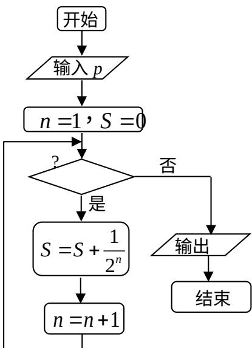

<!-- question-source:start -->
16. 设 $x, y$ 满足约束条件 $\left\{ \begin{array}{l} x - y + 2 \geq 0, \\ 5x - y - 10 \leq 0; \\ x \geq 0, \\ y \geq 0, \end{array} \right.$

则 $z = 2x + y$ 的最大值为

##
<!-- question-source:end -->

![[高中/真题/按年份分类/2008/2008年山东高考数学文科试题及答案/填空题/题目/answers/Q00027783A1.md]]
