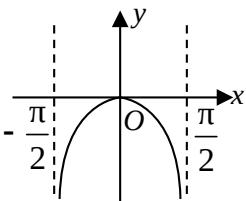
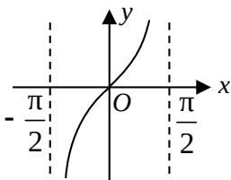
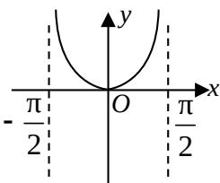
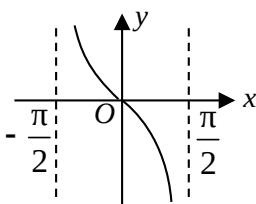

<!-- question-source:start -->
3. 函数 $y = \ln \cos x \left( -\frac{\pi}{2} < x < \frac{\pi}{2} \right)$ 的图象是（）

A.

B.

C.

  
D.
<!-- question-source:end -->

![[高中/真题/按年份分类/2008/2008年山东高考数学文科试题及答案/选择题/题目/answers/Q00026235A1.md]]
