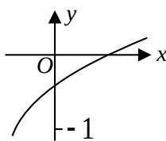

<!-- question-source:start -->
12. 已知函数 $f(x)=\log_{a}(2^{x}+b-1)(a>0,a\neq1)$ 的图象如图所示，则 a,b 满足的关系是
( )
A. $0 < a^{-1} < b < 1$ B. $0 < b < a^{-1} < 1$ C. $0 < b^{-1} < a < -1$ D. $0 < a^{-1} < b^{-1} < 1$

<!-- question-source:end -->

![[高中/真题/按年份分类/2008/2008年山东高考数学文科试题及答案/选择题/题目/answers/Q00026244A1.md]]
