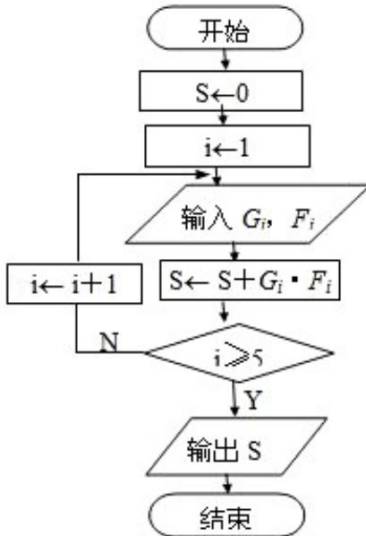

# 2008年江苏省高考数学试卷

##
一、填空题（共14小题，每小题5分，满分70分）

1. (5分) (2008·江苏) 若函数 $y = \cos (\omega x - \frac{\pi}{6}) \quad (\omega > 0)$ 最小正周期为 $\frac{\pi}{5}$ ，则 $\omega =$ \_\_\_\_.

2. (5 分) (2008·江苏) 若将一颗质地均匀的骰子 (一种各面上分别标有 1, 2, 3, 4, 5, 6 个点的正方体玩具), 先后抛掷两次, 则出现向上的点数之和为 4 的概率是 \_\_\_\_.

3. （5分）（2008·江苏）若将复数 $\frac{1 + i}{1 - i}$ 表示为 $a + bi$ （ $a, b \in R, i$ 是虚数单位）的形式，则 $a + b =$ \_\_\_\_.

4. (5分) (2008·江苏) 若集合 $A = \{x \mid (x - 1)^2 < 3x + 7, x \in R\}$ , 则 $A \cap Z$ 中有 \_\_\_\_ 个元素.

5. (5分) (2008·江苏) 已知向量 $\vec{a}$ 和 $\vec{b}$ 的夹角为 $120^{\circ}$ , $|\vec{a}| = 1$ , $|\vec{b}| = 3$ , 则 $|5\vec{a} - \vec{b}| =$ \_\_\_\_.

6. (5 分) (2008·江苏) 在平面直角坐标系 xoy 中, 设 D 是横坐标与纵坐标的绝对值均不大于 2 的点构成的区域, E 是到原点的距离不大于 1 的点构成的区域, 向 D 中随机投一点, 则所投点在 E 中的概率是 \_\_\_\_.

7. (5 分) (2008·江苏) 某地区为了解 70 - 80 岁的老人的日平均睡眠时间 (单位: h), 随机选择了 50 位老人进行调查, 下表是这 50 位老人睡眠时间的频率分布表:

<table><tr><td>序号i</td><td>分组(睡眠时间)</td><td>组中值(Gi)</td><td>频数(人数)</td><td>频率(Fi)</td></tr><tr><td>1</td><td>[4, 5)</td><td>4.5</td><td>6</td><td>0.12</td></tr><tr><td>2</td><td>[5, 6)</td><td>5.5</td><td>10</td><td>0.20</td></tr><tr><td>3</td><td>[6, 7)</td><td>6.5</td><td>20</td><td>0.40</td></tr><tr><td>4</td><td>[7, 8)</td><td>7.5</td><td>10</td><td>0.20</td></tr><tr><td>5</td><td>[8, 9]</td><td>8.5</td><td>4</td><td>0.08</td></tr></table>

在上述统计数据的
分析中一部分计算见算法流程图，则输出的 S 的值为 \_\_\_\_.

8. （5分）（2008·江苏）设直线 $y = \frac{1}{2} x + b$ 是曲线 $y = \ln x (x > 0)$ 的一条切线，则实数 $b$ 的值为 \_\_\_\_.

9. (5分) (2008·江苏) 如图, 在平面直角坐标系 $xoy$ 中, 设三角形 ABC 的顶点分别为 A $(0, a)$ , B $(b, 0)$ , C $(c, 0)$ , 点 P $(0, p)$ 在线段 AO 上的一点 (异于端点), 这里 a, b, c, p 均为非零实数, 设直线 BP, CP 分别与边 AC, AB 交于点 E, F, 某同学已正确求得直线 OE 的方程为 $\left(\frac{1}{b} - \frac{1}{c}\right)x + \left(\frac{1}{p} - \frac{1}{a}\right)y = 0$ , 请你完成直线 OF 的方程: \_\_\_\_.

10. (5 分) (2008·江苏) 将全体正整数排成一个三角形数阵: 按照以上排列的规律, 第 n 行 (n≥3) 从左向右的第 3 个数为 \_\_\_\_.

11. （5分）（2008·江苏）设 x，y，z 为正实数，满足 $x - 2y + 3z = 0$ ，则 $\frac{y^{2}}{xz}$ 的最小值是 \_\_\_\_.

12. (5分) (2008·江苏) 在平面直角坐标系 xOy 中, 椭圆 $\frac{x^2}{a^2} + \frac{y^2}{b^2} = 1$ ( $a > b > 0$ ) 的焦距为 2c, 以 O 为圆心, a 为半径作圆 M, 若过 P ( $\frac{a^2}{c}$ , 0) 作圆 M 的两条切线相互垂直, 则椭圆的离心率为 \_\_\_\_.

13. (5分) (2008·江苏) 满足条件 AB=2, AC= $\sqrt{2}$ BC 的三角形 ABC 的面积的最大值是 \_\_\_\_.

14. （5分）（2008·江苏）f(x) = ax $^{3}$ - 3x+1 对于 x∈[-1, 1]总有 f(x) ≥0 成立，则 a= \_\_\_\_.

##
二、解答题（共12小题，满分90分）

15. (15 分) (2008·江苏) 如图, 在平面直角坐标系 xOy 中, 以 Ox 轴为始边作两个锐角 $\alpha, \beta$ , 它们的终边分别交单位圆于 A, B 两点. 已知 A, B 两点的横坐标分别是 $\frac{\sqrt{2}}{10}, \frac{2\sqrt{5}}{5}$ .

(1) 求 $\tan (\alpha + \beta)$ 的值；

(2) 求 $\alpha + 2\beta$ 的值.

16.（15分）（2008·江苏）如图，在四面体ABCD中，CB=CD，AD⊥BD，点E，F分别是AB，BD的中点．求证：

(1) 直线 EF 面 ACD;

(2) 平面 EFC⊥面 BCD.

17. （15分）（2008·江苏）如图，某地有三家工厂，分别位于矩形ABCD的两个顶点A，B及CD的中点P处。AB=20km，BC=10km。为了处理这三家工厂的污水，现要在该矩形区域上（含边界）且与A，B等距的一点O处，建造一个污水处理厂，并铺设三条排污管道AO，BO，PO。记铺设管道的总长度为ykm。

(1) 按下列要求建立函数关系式:

(i) 设 $\angle BAO = \theta$ (rad)，将y表示成 $\theta$ 的函数；

(ii) 设 OP=x (km)，将 y 表示成 x 的函数；

(2) 请你选用
（1）中的一个函数关系确定污水处理厂的位置，使铺设的污水管道的总长度最短.

18. (15 分) (2008·江苏) 在平面直角坐标系 xOy 中, 记二次函数 $f(x) = x^2 + 2x + b (x \in \mathbb{R})$ 与两坐标轴有三个交点. 经过三个交点的圆记为 C.

(1) 求实数 b 的取值范围;

(2) 求圆 C 的方程;

(3) 问圆 C 是否经过定点（其坐标与 b 的无关）？请证明你的结论.

19. (15 分) (2008·江苏)
(1) 设 $a_1, a_2, \cdots, a_n$ 是各项均不为零的 $n (n \geq 4)$ 项等差数列，且公差 $d \neq 0$ ，若将此数列删去某一项后得到的数列（按原来的顺序）是等比数列。

(i) 当 $n = 4$ 时，求 $\frac{a_1}{d}$ 的数值；

(ii) 求 n 的所有可能值.

(2) 求证: 对于给定的正整数 $n (n \geq 4)$ ，存在一个各项及公差均不为零的等差数列 $b_1, b_2, \cdots, b_n$ ，其中任意三项（按原来的顺序）都不能组成等比数列.

20. (15 分) (2008·江苏) 已知函数 $f_1(x) = 3^{|x - p_1|}$ , $f_2(x) = 2 \cdot 3^{|x - p_2|} (x \in \mathbb{R}, p_1, p_2 \text{为常数})$ . 函数 $f(x)$ 定义为：对每个给定的实数 $x$ , $f(x) = \begin{cases} f_1(x) & \text{若 } f_1(x) \leqslant f_2(x) \\ f_2(x) & \text{若 } f_1(x) > f_2(x) \end{cases}$

(1) 求 $f(x) = f_1(x)$ 对所有实数 $x$ 成立的充分必要条件（用 $p_1, p_2$ 表示）；

(2) 设 $a, b$ 是两个实数，满足 $a < b$ ，且 $p_1, p_2 \in (a, b)$ . 若 $f(a) = f(b)$ ，求证：函数 $f(x)$ 在区间 $[a, b]$ 上的单调增区间的长度之和为 $\frac{b - a}{2}$ （闭区间 $[m, n]$ 的长度定义为 $n - m$ )

21. (2008·江苏) 如图, $\triangle ABC$ 的外接圆的切线 $AE$ 与 $BC$ 的延长线相交于点 $E$ , $\angle BAC$ 的平分线与 $BC$ 交于点 $D$ . 求证: $ED^{2} = EB \cdot EC$ .

22. (2008·江苏) 在平面直角坐标系 xOy 中, 设椭圆 $4x^{2} + y^{2} = 1$ 在矩阵 $\left| \begin{array}{ll} 2 & 0 \\ 0 & 1 \end{array} \right|$ 对应的变换作用下得到曲线 F, 求 F 的方程.

23. (2008·江苏) 在平面直角坐标系 xOy 中, 点 P (x, y) 是椭圆 $\frac{x^2}{3} + y^2 = 1$ 上的一个动点, 求 S = x + y 的最大值.

24. (2008·江苏) 设 a, b, c 为正实数, 求证: $\frac{1}{a^3} + \frac{1}{b^3} + \frac{1}{c^3} + abc \geqslant 2\sqrt{3}$ .

25. (2008·江苏) 记动点 P 是棱长为 1 的正方体 ABCD - A₁B₁C₁D₁ 的对角线 BD₁ 上一点, 记 $\frac{D_1P}{D_1B} = \lambda$ . 当 $\angle APC$ 为钝角时, 求 $\lambda$ 的取值范围.

26. （2008·江苏）请先阅读：

在等式 $\cos2x=2\cos^{2}x-1(x\in R)$ 的两边求导，得： $(\cos2x)'=(2\cos^{2}x-1)'$ ，由求导法则，得 $(-sin2x)\cdot2=4\cos x\cdot(-sin x)$ ，化简得等式： $\sin2x=2\cos x\cdot\sin x$ .
(1) 利用上题的想法（或其他方法），结合等式 $(1+x)^{n=C_{n}^{0}+C_{n}^{1}x+C_{n}^{2}x^{2}+\ldots+C_{n}^{n}x^{n}(x\in R,正整数n\geq2))$ ，证明： $n[(1+x)^{n-1}-1]=\sum_{k=2}^{n}kC_{n}^{k}x^{k-1}.$

(2) 对于正整数 $n \geq 3$ ，求证：
(i) $\sum_{k=1}^{n}(-1)^{k}kC_{n}^{k}=0;$

(ii) $\sum_{k=1}^{n} (-1)^{k} k^2 C_n^k = 0$ ;

(iii) $\sum_{k=1}^{n} \frac{1}{k+1} C_n^k = \frac{2^{n+1} - 1}{n+1}$ .

# 2008年江苏省高考数学试卷

参考
答案与
试题
解析

##

![[高中/真题/按年份分类/2008/2008年江苏高考数学试题及答案/填空题/填空题.md]]
![[高中/真题/按年份分类/2008/2008年江苏高考数学试题及答案/解答题/解答题.md]]
