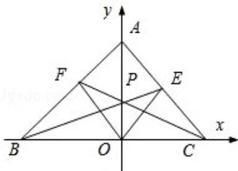

<!-- question-source:start -->
9. (5分) (2008·江苏) 如图, 在平面直角坐标系 $xoy$ 中, 设三角形 ABC 的顶点分别为 A $(0, a)$ , B $(b, 0)$ , C $(c, 0)$ , 点 P $(0, p)$ 在线段 AO 上的一点 (异于端点), 这里 a, b, c, p 均为非零实数, 设直线 BP, CP 分别与边 AC, AB 交于点 E, F, 某同学已正确求得直线 OE 的方程为 $\left(\frac{1}{b} - \frac{1}{c}\right)x + \left(\frac{1}{p} - \frac{1}{a}\right)y = 0$ , 请你完成直线 OF 的方程: \_\_\_\_.

<!-- question-source:end -->

![[高中/真题/按年份分类/2008/2008年江苏高考数学试题及答案/填空题/题目/answers/Q00024108A1.md]]
