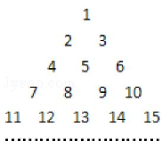

<!-- question-source:start -->
10. (5 分) (2008·江苏) 将全体正整数排成一个三角形数阵: 按照以上排列的规律, 第 n 行 (n≥3) 从左向右的第 3 个数为 \_\_\_\_.

<!-- question-source:end -->

![[高中/真题/按年份分类/2008/2008年江苏高考数学试题及答案/填空题/题目/answers/Q00024109A1.md]]
