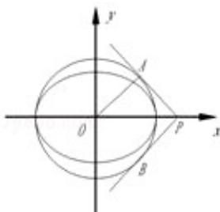

<!-- question-source:start -->
12. (5分) (2008·江苏) 在平面直角坐标系 xOy 中, 椭圆 $\frac{x^2}{a^2} + \frac{y^2}{b^2} = 1$ ( $a > b > 0$ ) 的焦距为 2c, 以 O 为圆心, a 为半径作圆 M, 若过 P ( $\frac{a^2}{c}$ , 0) 作圆 M 的两条切线相互垂直, 则椭圆的离心率为 \_\_\_\_.

<!-- question-source:end -->

![[高中/真题/按年份分类/2008/2008年江苏高考数学试题及答案/填空题/题目/answers/Q00024111A1.md]]
