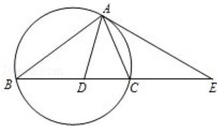

<!-- question-source:start -->
21. (2008·江苏) 如图, $\triangle ABC$ 的外接圆的切线 $AE$ 与 $BC$ 的延长线相交于点 $E$ , $\angle BAC$ 的平分线与 $BC$ 交于点 $D$ . 求证: $ED^{2} = EB \cdot EC$ .

<!-- question-source:end -->

![[高中/真题/按年份分类/2008/2008年江苏高考数学试题及答案/填空题/题目/answers/Q00024120A1.md]]
