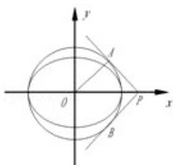

> [!faq]- 2008年江苏高考数学试题及答案解析
>
> > [!success]- **【答案】** $\frac{\sqrt{2}}{2}$
>
> > [!note]- **【分析】**
> > 抓住 $\triangle$ OAP是等腰直角三角形，建立a，c的关系，问题迎刃而解.
>
> > [!note]- **【解析】**
> > 解：设切线PA、PB互相垂直，又半径OA垂直于PA，所以 $\triangle$ OAP是等腰直角三角形，
> >
> > 故 $\frac{a^2}{c} = \sqrt{2} a,$
> >
> > 解得 $e=\frac{c}{a}=\frac{\sqrt{2}}{2}$ ,
> >
> > 故答案为 $\frac{\sqrt{2}}{2}$ .
> >
> > 
> >
> > 点评：本题考查了椭圆的离心率，有助于提高学生分析问题的能力。
