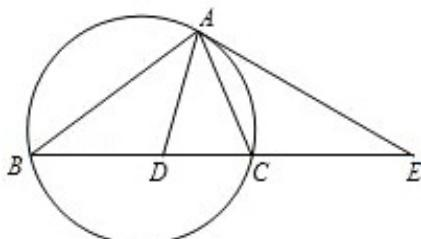

> [!faq]- 2008年江苏高考数学试题及答案解析
>
> > [!success]- **【答案】** 详见解析
>
> > [!note]- **【分析】**
> > 根据已知 EA 是圆的切线, AC 为过切点 A 的弦得两个角相等, 再结合角平分线条件, 从而得到 $\triangle EAD$ 是等腰三角形, 再根据切割线定理即可证得.
>
> > [!note]- **【解析】**
> > 证明: 因为 EA 是圆的切线, AC 为过切点 A 的弦,
> >
> > 所以 $\angle CAE = \angle CBA$ .
> >
> > 又因为 AD 是 DBAC 的平分线，所以 $\angle BAD = \angle CAD$
> >
> > 所以 $\angle DAE = \angle DAC + \angle EAC = \angle BAD + \angle CBA = \angle ADE$
> >
> > 所以， $\triangle EAD$ 是等腰三角形，所以 EA=ED.
> >
> > 又 $EA^{2}=EC\cdot EB$ ,
> >
> > 所以 $ED^{2}=EB\cdot EC$ .
> >
> > 
> >
> > 点评: 此题主要是运用了弦切角定理的切割线定理。注意: 切线长的平方应是 EB 和 EC 的乘积.
