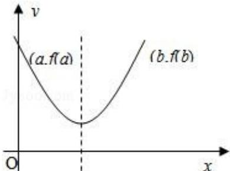
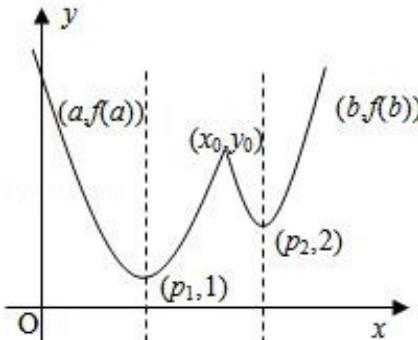

> [!faq]- 2008年江苏高考数学试题及答案解析
>
> > [!success]- **【答案】** 详见解析
>
> > [!note]- **【分析】**
> > (1) 根据题意，先证充分性：由 $f(x)$ 的定义可知， $f(x) = f_1(x)$ 对所有实数成立，等价于 $f_1(x) \leqslant f_2(x)$ 对所有实数 $x$ 成立等价于 $3^{|x - p_1|} \leqslant 2 \cdot 3^{|x - p_2|}$ ，即 $3^{|x - p_1| - |x - p_2|} \leqslant 3^{\log_3 2} = 2$ 对所有实数 $x$ 均成立，分析容易得证；再证必要性： $3^{|x - p_1| - |x - p_2|} \leqslant 3^{\log_3 2} = 2$ 对所有实数 $x$ 均成立等价于 $3^{|p_1 - p_2|} \leqslant 2$ ，即 $|p_1 - p_2| \leqslant \log_3 2$ ，
> > (2) 分两种情形讨论: ①当 $|p_1 - p_2| \leq \log_3 2$ 时, 由中值定理及函数的单调性得到函数 $f(x)$ 在区间 $[a, b]$ 上的单调增区间的长度; ②当 $|p_1 - p_2| > \log_3 2$ 时, $a, b$ 是两个实数, 满足 $a < b$ , 且 $p_1, p_2 \in (a, b)$ . 若 $f(a) = f(b)$ , 根据图象和函数的单调性得到函数 $f(x)$ 在区间 $[a, b]$ 上的单调增区间的长度.
>
> > [!note]- **【解析】**
> > 解：
> > (1) 由 $f(x)$ 的定义可知， $f(x) = f_1(x)$ （对所有实数 $x$ ）等价于 $f_1(x) \leqslant f_2(x)$ （对所有实数 $x$ ）这又等价于 $3^{|x - p_1|} \leqslant 2 \cdot 3^{|x - p_2|}$ ，即 $3^{|x - p_1| - |x - p_2|} \leqslant 3^{\log_3 2} = 2$ 对所有实数 $x$ 均成立。（\*）
> > 由于 $|x - p_1| - |x - p_2| \leqslant |(x - p_1) - (x - p_2)| = |p_1 - p_2|$ （ $x \in R$ ）的最大值为 $|p_1 - p_2|$ ，故（\*）等价于 $3^{|p_1 - p_2|} \leqslant 2$ ，即 $|p_1 - p_2| \leqslant \log_3 2$ ，这就是所求的充分必要条件
> > (2) 分两种情形讨论
> >
> > (i) 当 $|p_{1}-p_{2}|\leq\log_{3}2$ 时，由
> > （1）知 $f(x)=f_{1}(x)$ （对所有实数 $x\in[a,b]$ ）
> >
> > 则由 f (a) = f (b) 及 $a < p_{1} < b$ 易知 $p_{1} = \frac{a + b}{2}$ ,
> >
> > 再由 $f_{1}(x) = \left\{ \begin{array}{ll}3^{p_{1} - x}, & x < p_{1}\\ 3^{x - p_{1}}, & x \geqslant p_{1} \end{array} \right.$ 的单调性可知，
> >
> > 函数 $f(x)$ 在区间 $[a, b]$ 上的单调增区间的长度
> >
> > 为 $b - \frac{a + b}{2} = \frac{b - a}{2}$ （参见示意图）
> >
> > 
> >
> > (ii) $|\mathrm{p}_1 - \mathrm{p}_2| > \log_32$ 时，不妨设 $\mathrm{p}_1 < \mathrm{p}_2$ ，则 $\mathrm{p}_2 - \mathrm{p}_1 > \log_32$ ，于是
> >
> > 当 $\mathrm{x}\leq \mathrm{p}_1$ 时，有 $f_{1}(x) = 3^{p_{1} - x} <   3^{p_{2} - x} <   f_{2}(x)$ ，从而f（x）=f（x）；
> >
> > 当 $x \geq p_2$ 时，有 $f_1(x) = 3^{x - p_1} = 3^{p_2 - p_1 + x - p_2} = 3^{p_2 - p_1} \cdot 3^{x - p_2} > 3^{\log_3 2} \cdot 3^{x - p_2} = f_2(x)$
> >
> > 从而 $f(x) = f_2(x)$ ; 当 $p_1 < x < p_2$ 时, $f_1(x) = 3^{x - p_1}$ , 及 $f_2(x) = 2 \cdot 3^{p_2 - x}$ , 由方程 $3^{x - p_1} = 2 \cdot 3^{p_2 - x}$ 解得 $f_1(x)$ 与 $f_2(x)$ 图象交点的横坐标为 $x_0 = \frac{p_1 + p_2}{2} + \frac{1}{2} \log_3 2$
> > (1)
> >
> > 显然 $p_{1}<x_{0}=p_{2}-\frac{1}{2}[(p_{2}-p_{1})-\log_{3}2]<p_{2},$
> >
> > 这表明 $\mathbf{x}_0$ 在 $p_1$ 与 $p_2$ 之间．由
> > （1）易知 $f(x) = \begin{cases} f_1(x), & p_1 \leqslant x \leqslant x_0 \\ f_2(x), & x_0 < x \leqslant p_2 \end{cases}$
> >
> > 综上可知，在区间[a，b]上， $f(x) = \begin{cases} f_1(x), & a \leqslant x \leqslant x_0 \\ f_2(x), & x_0 < x \leqslant b \end{cases}$ （参见示意图）
> >
> > 
> >
> > 故由函数 $f_{1}(x)$ 及 $f_{2}(x)$ 的单调性可知， $f(x)$ 在区间 $[a, b]$ 上的单调增区间的长度之和为 $(x_{0} - p_{1}) + (b - p_{2})$ ，由于 $f(a) = f(b)$ ，即 $3^{p_{1} - a} = 2 \cdot 3^{b - p_{2}}$ ，得 $p_{1} + p_{2} = a + b + \log_{3} 2$
> > （2）
> >
> > 故由（1）、
> > （2）得 $(x_0 - p_1) + (b - p_2) = b - \frac{1}{2} [p_1 + p_2 - \log_3 2] = \frac{b - a}{2}$
> >
> > 综合（i）（ii）可知，f（x）在区间[a，b]上的单调增区间的长度和为 $\frac{b-a}{2}$ .
> >
> > 点评: 考查学生理解充分必要条件的证明方法, 用数形结合的数学思想解决问题的能力, 以及充分必要条件的证明方法.
