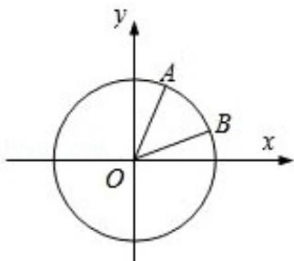

<!-- question-source:start -->
15. (15 分) (2008·江苏) 如图, 在平面直角坐标系 xOy 中, 以 Ox 轴为始边作两个锐角 $\alpha, \beta$ , 它们的终边分别交单位圆于 A, B 两点. 已知 A, B 两点的横坐标分别是 $\frac{\sqrt{2}}{10}, \frac{2\sqrt{5}}{5}$ .

(1) 求 $\tan (\alpha + \beta)$ 的值；

(2) 求 $\alpha + 2\beta$ 的值.

<!-- question-source:end -->

![[高中/真题/按年份分类/2008/2008年江苏高考数学试题及答案/解答题/题目/answers/Q00024114A1.md]]
