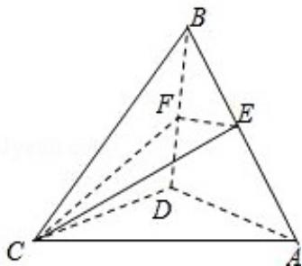

<!-- question-source:start -->
16.（15分）（2008·江苏）如图，在四面体ABCD中，CB=CD，AD⊥BD，点E，F分别是AB，BD的中点．求证：

(1) 直线 EF 面 ACD;

(2) 平面 EFC⊥面 BCD.

<!-- question-source:end -->

![[高中/真题/按年份分类/2008/2008年江苏高考数学试题及答案/解答题/题目/answers/Q00024115A1.md]]
