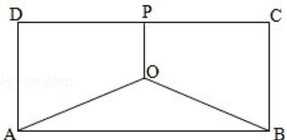

<!-- question-source:start -->
17. （15分）（2008·江苏）如图，某地有三家工厂，分别位于矩形ABCD的两个顶点A，B及CD的中点P处。AB=20km，BC=10km。为了处理这三家工厂的污水，现要在该矩形区域上（含边界）且与A，B等距的一点O处，建造一个污水处理厂，并铺设三条排污管道AO，BO，PO。记铺设管道的总长度为ykm。

(1) 按下列要求建立函数关系式:

(i) 设 $\angle BAO = \theta$ (rad)，将y表示成 $\theta$ 的函数；

(ii) 设 OP=x (km)，将 y 表示成 x 的函数；

(2) 请你选用（1）中的一个函数关系确定污水处理厂的位置，使铺设的污水管道的总长度最短.

<!-- question-source:end -->

![[高中/真题/按年份分类/2008/2008年江苏高考数学试题及答案/解答题/题目/answers/Q00024116A1.md]]
