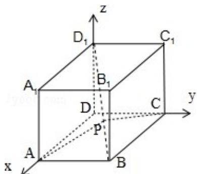

> [!faq]- 2008年江苏高考数学试题及答案解析
>
> > [!success]- **【答案】** 详见解析
>
> > [!note]- **【分析】**
> > 由题意易知 $\angle APC$ 不可能为平角，则 $\angle APC$ 为钝角等价于 $\cos \angle APC = \cos < \overrightarrow{PA}$ ， $\overrightarrow{PC} > = \frac{\overrightarrow{PA} \cdot \overrightarrow{PC}}{|\overrightarrow{PA}| \cdot |\overrightarrow{PC}|} < 0$ ，即 $\overrightarrow{PA} \cdot \overrightarrow{PC} < 0$ ，再将 $\overrightarrow{PA}$ ， $\overrightarrow{PC}$ 用关于 $\lambda$ 的字母表示，根据向量数量积的坐标运算即可
>
> > [!note]- **【解析】**
> > 分析:
> >
> > 由题意易知 $\angle APC$ 不可能为平角，则 $\angle APC$ 为钝角等价于 $\cos \angle APC = \cos < \overrightarrow{PA}$ ， $\overrightarrow{PC} > = \frac{\overrightarrow{PA} \cdot \overrightarrow{PC}}{|\overrightarrow{PA}| \cdot |\overrightarrow{PC}|} < 0$ ，即 $\overrightarrow{PA} \cdot \overrightarrow{PC} < 0$ ，再将 $\overrightarrow{PA}$ ， $\overrightarrow{PC}$ 用关于 $\lambda$ 的字母表示，根据向量数量积的坐标运算即可
> >
> > 解答：解：由题设可知，以 $\overrightarrow{\mathrm{DA}}$ 、 $\overrightarrow{\mathrm{DC}}$ 、 $\overrightarrow{\mathrm{DD}_1}$ 为单位正交基底，
> >
> > 建立如图所示的空间直角坐标系 D - xyz，
> >
> > 则有 A（1，0，0），B（1，1，0），C（0，1，0），D（0，0，1）
> >
> > 由 $\overrightarrow{\mathrm{D}_1\mathrm{B}} = (1,1, - 1)$ ，得 $\overrightarrow{\mathrm{D}_1\mathrm{P}} = \lambda \overrightarrow{\mathrm{D}_1\mathrm{B}} = (\lambda ,\lambda , - \lambda)$ ，所以
> >
> > $$
> > \overrightarrow {\mathrm{PA}} = \overrightarrow {\mathrm{PD} _ {1}} + \overrightarrow {\mathrm{D} _ {1} \mathrm{A}} = (- \lambda , - \lambda , \lambda) + (1, 0, - 1) = (1 - \lambda , - \lambda , \lambda - 1)
> > $$
> >
> > $$
> > \overrightarrow {\mathrm{PC}} = \overrightarrow {\mathrm{PD} _ {1}} + \overrightarrow {\mathrm{D} _ {1} \mathrm{C}} = (- \lambda , - \lambda , \lambda) + (0, 1, - 1) = (- \lambda , 1 - \lambda , \lambda - 1)
> > $$
> >
> > 显然 $\angle APC$ 不是平角，所以 $\angle APC$ 为钝角等价于 $\cos \angle APC = \cos < \overrightarrow{PA}$ ， $\overrightarrow{PC} > = \frac{\overrightarrow{PA} \cdot \overrightarrow{PC}}{|\overrightarrow{PA}| \cdot |\overrightarrow{PC}|} < 0$ ，则等价于 $\overrightarrow{PA} \cdot \overrightarrow{PC} < 0$
> >
> > 即 $(1-\lambda)$ $(-\lambda)+(-\lambda)$ $(1-\lambda)+(\lambda-1)^{2}=(\lambda-1)$ $(3\lambda-1)<0$ ，得 $\frac{1}{3}<\lambda<1$
> >
> > 因此， $\lambda$ 的取值范围是 $(\frac{1}{3}, 1)$
> >
> > 
> >
> > 点评：本题考查了用空间向量求直线间的夹角，一元二次不等式的解法，属于基础题.
