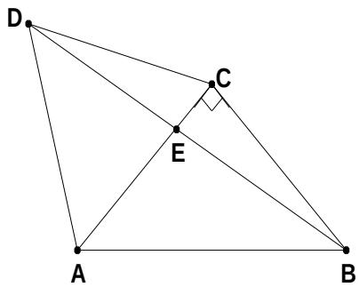

<!-- question-source:start -->
17、(本小题满分 12 分) 如图, $\triangle ACD$ 是等边三角形, $\triangle ABC$ 是等腰直角三角形, $\angle ACB = 90^{\circ}$ , BD 交 AC 于 E, AB = 2。
(1) 求 $\cos \angle CBE$ 的值;
(2) 求 $AE$ 。

<!-- question-source:end -->

![[高中/真题/按年份分类/2008/2008年海南省高考文科数学试题及答案/填空题/题目/answers/Q00029492A1.md]]
