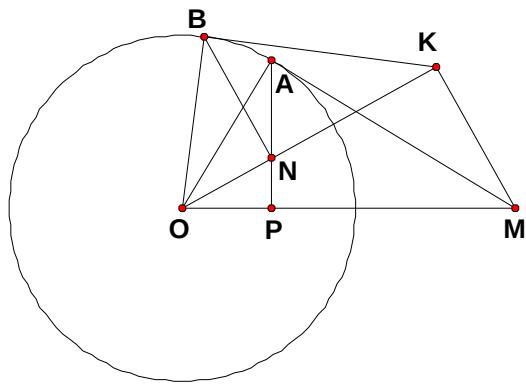

<!-- question-source:start -->
22、（本小题满分10分）选修4-1：几何证明选讲

如图，过圆 O 外一点 M 作它的一条切线，切点为 A，过 A 作直线 AP 垂直直线 OM，垂足为 P。

(1) 证明: $OM \cdot OP = OA^2$ ;

(2) N 为线段 AP 上一点，直线 NB 垂直直线 ON，且交圆 O 于 B 点。过 B 点的切线交直线 ON 于 K。证明： $\angle OKM = 90^{\circ}$ 。

<!-- question-source:end -->

![[高中/真题/按年份分类/2008/2008年海南省高考文科数学试题及答案/解答题/题目/answers/Q00023679A1.md]]
