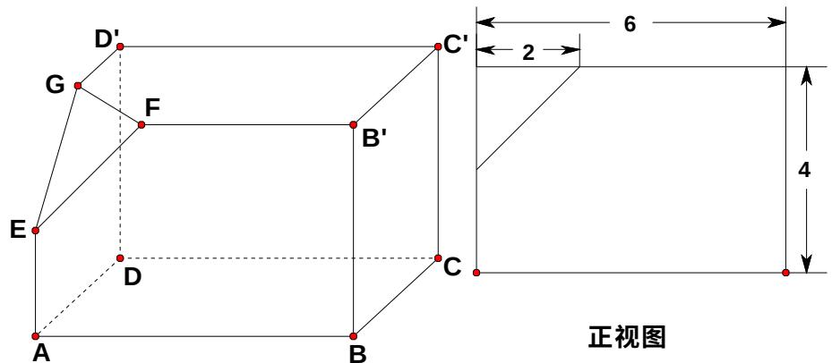
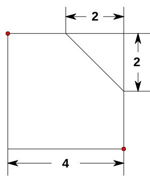

<!-- question-source:start -->
18、（本小题满分 12 分）如下的三个图中，上面的是一个长方体截去一个角所得多面体的直观图，它的正视图和侧视图在下面画出（单位：cm）。
(1) 在正视图下面，按照画三视图的要求画出该多面体的俯视图；
(2) 按照给出的尺寸，求该多面体的体积；
(3) 在所给直观图中连结 $BC'$ ，证明： $BC' \parallel$ 面 EFG。

  
侧视图
<!-- question-source:end -->

![[高中/真题/按年份分类/2008/2008年海南省高考文科数学试题及答案/解答题/题目/answers/Q00029493A1.md]]
