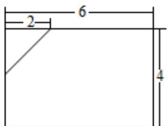
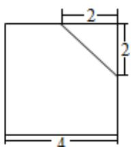
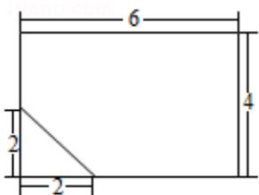
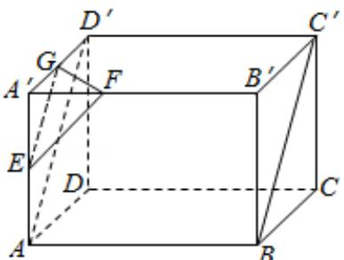

> [!faq]- 2008年海南省高考文科数学试题及答案解析
>
> > [!success]- **【答案】** 详见解析
>
> > [!note]- **【分析】**
> > （1）按照三视图的要求直接在正视图下面，画出该多面体的俯视图；
> > (2) 按照给出的尺寸, 利用转化思想 $\mathrm{V} = \mathrm{V}_{\text {长方体 }} - \mathrm{V}_{\text {正三棱锥}}$ , 求该多面体的体积;
> > (3) 在长方体 ABCD - A'B'C'D' 中，连接 AD'，在所给直观图中连接 BC'，证明 EG∥BC'，即可证明 BC'∥面 EFG.
>
> > [!note]- **【解析】**
> > 解：
> > （1）如图
> >
> >   
> > 正视图
> >
> >   
> > 侧视图
> >
> >   
> > 俯视图
> > (2) 所求多面体的体积
> >
> > $V=V_{长方体}-V_{正三棱锥}=4\times4\times6-\frac{1}{3}\times\left(\frac{1}{2}\times2\times2\right)\times2=\frac{284}{3}\left(cm^{3}\right)$
> > (3) 证明：如图，
> >
> > 
> >
> > 在长方体 ABCD - A'B'C'D' 中，连接 AD'，则 AD' || BC'
> >
> > 因为 E，G 分别为 AA'，A'D' 中点，所以 AD' || EG，从而 EG || BC'，
> >
> > 又EG⊂平面EFG，所以BC'∥平面EFG；
> >
> > 【点评】长方体的有关知识、体积计算及三视图的相关知识，对三视图的相关知识掌握不到位，求不出有关数据．三视图是新教材中的新内容，故应该是新高考的热点之一，要予以足够的重视.
