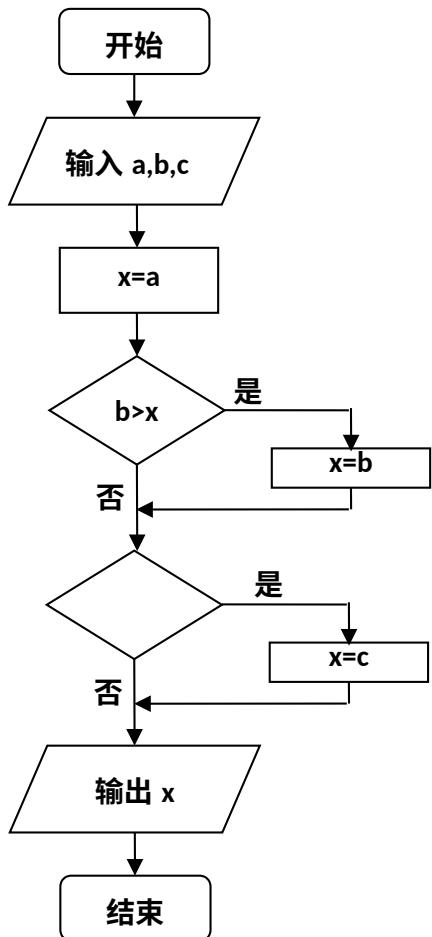

<!-- question-source:start -->
6、右面的程序框图，如果输入三个实数 a、b、c，要求输出这三个数中最大的数，那么在空白的判断框中，应该填入下面四个选项中的（）
A. c > x    B. x > c    C. c > b    D. b > c

<!-- question-source:end -->

![[高中/真题/按年份分类/2008/2008年海南省高考文科数学试题及答案/选择题/题目/answers/Q00023663A1.md]]
