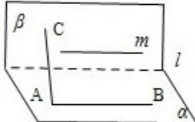
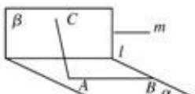

> [!faq]- 2008年海南省高考文科数学试题及答案解析
>
> > [!success]- **【答案】** D
>
> > [!note]- **【分析】**
> > 利用图形可得 AB||l||m；A 对
>
> > [!note]- **【解析】**
> > 分析】利用图形可得 AB||l||m；A 对
> >
> > 再由 AC⊥l，m∥l⇒AC⊥m；B 对
> >
> > 
> >
> > 又 AB||l⇒AB||β，C 对
> >
> > AC⊥l, 但 AC 不一定在平面 $\alpha$ 内, 故它可以与平面 $\beta$ 相交、平行, 故不一定垂直, 所以 D 不一定成立.
> >
> > 【
> > 解答】解：如图所示 AB||l||m；A 对
> >
> > AC⊥l，m∥l⇒AC⊥m；B对
> >
> > $\mathrm{AB}\| \mathrm{l}\Rightarrow \mathrm{AB}\| \beta$ ，C对
> >
> > 对于 D, 虽然 AC⊥l, 但 AC 不一定在平面 $\alpha$ 内, 故它可以与平面 $\beta$ 相交、平行, 故不一定垂直; 故错. 故选 D.
> >
> > 
> >
> > 【点评】高考考点：线面平行、线面垂直的有关知识及应用
> >
> > 易错点：对有关定理理解不到位而出错.
> >
> > 全品备考提示：线面平行、线面垂直的判断及应用仍然是立体几何的一个重点，要重点掌握
> >
> > ## 二、填空题（共4小题，每小题5分，满分20分）
