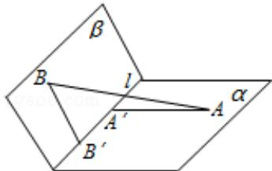

<!-- question-source:start -->
20. (12 分) (2008·重庆) 如图, $\alpha$ 和 $\beta$ 为平面, $\alpha \cap \beta = 1$ , $A \in \alpha$ , $B \in \beta$ , $AB = 5$ , $A$ , $B$ 在棱 $l$ 上的射影分别为 $A'$ , $B'$ , $AA' = 3$ , $BB' = 2$ . 若二面角 $\alpha - 1 - \beta$ 的大小为 $\frac{2\pi}{3}$ , 求:

（Ⅰ）点 B 到平面 $\alpha$ 的距离；

（Ⅱ）异面直线l与AB所成的角（用反三角函数表示）.

<!-- question-source:end -->

![[高中/真题/按年份分类/2008/2008年重庆市高考数学试卷_文科_含答案/填空题/题目/answers/Q00022987A1.md]]
