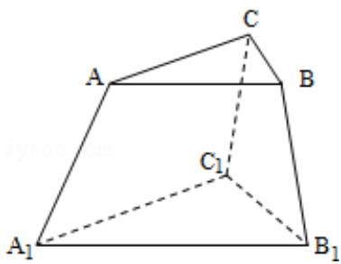

<!-- question-source:start -->
16. (4 分) (2008·重庆) 某人有 3 种颜色的灯泡 (每种颜色的灯泡足够多), 要在如图所示的 6 个点 A、B、C、 $A_1$ 、 $B_1$ 、 $C_1$ 上各安装一个灯泡, 要求同一条线段两端的灯泡不同色, 则不同的安装方法共有 \_\_\_\_ 种 (用数字作答).

<!-- question-source:end -->

![[高中/真题/按年份分类/2008/2008年重庆市高考数学试卷_文科_含答案/填空题/题目/answers/Q00027367A1.md]]
