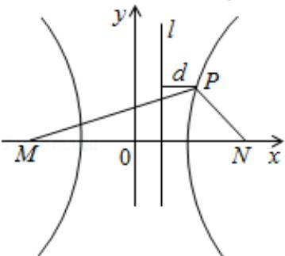

> [!faq]- 2008年重庆市高考数学试卷(文科)含答案解析
>
> > [!success]- **【答案】** 详见解析
>
> > [!note]- **【分析】**
> > （1）联系双曲线的第一定义，半焦距 c=2，实半轴 a=1，从而虚半轴 $b=\sqrt{3}$ ，
> > (2) 联系双曲线的第二定义，到定点距离比上到对应直线的距离等于常数 $e$ （离心率）．
>
> > [!note]- **【解析】**
> > 解：（I）由双曲线的定义，点 $P$ 的轨迹是以 $M$ 、 $N$ 为焦点，实轴长 $2a = 2$ 的双曲线．因此半焦距 $c = 2$ ，实半轴 $a = 1$ ，从而虚半轴 $b = \sqrt{3}$ ，
> >
> > 所以双曲线的方程为 $x^{2}-\frac{y^{2}}{3}=1$
> >
> > (II) 解法一:
> >
> > 由（I）及答
> > （21）图，易知 $|\mathrm{PN}| \geq 1$ ，因 $|\mathrm{PM}| = 2|\mathrm{PN}|^2$ ，①
> >
> > 知 $|\mathrm{PM}|>|\mathrm{PN}|$ ，故P为双曲线右支上的点，所以 $|\mathrm{PM}|=|\mathrm{PN}|+2$ ．②
> >
> > 将②代入①，得 $2||\mathrm{PN}|^2 -|\mathrm{PN}| - 2 = 0$ ，解得 $\vert \mathrm{PN}\vert = \frac{1\pm\sqrt{17}}{4}$ ，舍去 $\frac{1 - \sqrt{17}}{4}$
> >
> > 所以 $|PN|=\frac{1+\sqrt{17}}{4}$ .
> >
> > 因为双曲线的离心率 $e = \frac{c}{a} = 2$ ，直线1： $x = \frac{1}{2}$ 是双曲线的右准线，故 $\frac{|PN|}{d} = e = 2$ ，
> >
> > 所以 $d = \frac{1}{2} |\mathrm{PN}|$ ，因此 $\frac{|\mathrm{PM}|}{\mathrm{d}} = \frac{2|\mathrm{PM}|}{|\mathrm{PN}|} = \frac{4|\mathrm{PN}|^2}{|\mathrm{PN}|} = 4|\mathrm{PN}| = 1 + \sqrt{17}$
> >
> > 解法二：
> >
> > 设 $\mathrm{P(x,y)}$ ，因 $|\mathrm{PN}|\geq 1$ 知
> >
> > $$
> > | \mathrm{PM} | = 2 | \mathrm{PN} | ^ {2} \geq \mathrm{PN} | > | \mathrm{PN} |,
> > $$
> >
> > 故 P 在双曲线右支上，所以 $x \geq$ 由双曲线方程有 $y^{2} = 3x^{2} - 3$ .
> >
> > 因此 $|\mathsf{PM}| = \sqrt{\left(\mathbf{x} + 2\right)^2 + \mathbf{y}^2} = \sqrt{\left(\mathbf{x} + 2\right)^2 + 3\mathbf{x}^2 - 3} = \sqrt{\left(2\mathbf{x} + 1\right)^2} = 2\mathbf{x} + 1$
> >
> > $$
> > \left| \mathrm{PN} \right| = \sqrt {\left(\mathrm{x} - 2\right) ^ {2} + \mathrm{y} ^ {2}} = \sqrt {\left(\mathrm{x} - 2\right) ^ {2} + 3 \mathrm{x} ^ {2} - 3} = \sqrt {4 \mathrm{x} ^ {2} - 4 \mathrm{x} + 1}.
> > $$
> >
> > 从而由 $|\mathrm{PM}| = 2|\mathrm{PN}|^2$ 得
> >
> > $2x+1=2\left(4x^{2}-4x+1\right)$ ，即 $8x^{2}-10x+1=0$ 。
> >
> > 所以 $x = \frac{5 + \sqrt{17}}{8}$ （舍去 $x = \frac{5 - \sqrt{17}}{8}$ ）
> >
> > 有 $|\mathrm{PM}|=2\mathrm{x}+1=\frac{9+\sqrt{17}}{4}$
> >
> > $$
> > \mathrm{d} = \mathrm{x} - \frac {1}{2} = \frac {1 + \sqrt {1 7}}{8}.
> > $$
> >
> > 故 $\frac{|PM|}{d}=\frac{9+\sqrt{17}}{4}\cdot\frac{8}{1+\sqrt{17}}=1+\sqrt{17}.$
> >
> > 
> >
> > 【点评】本小题主要考查双曲线的第一定义、第二定义，及转化与化归、数形结合的数学思想，同时考查了学生的运算能力.
