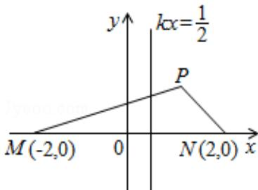

<!-- question-source:start -->
21. (12 分) (2008·重庆) 如图, M(-2,0) 和 N(2,0) 是平面上的两点, 动点 P 满足: $\left|\left|PM\right|-\left|PN\right|\right|=2$ .

（Ⅰ）求点 P 的轨迹方程；

（II）设 d 为点 P 到直线 l： $x=\frac{1}{2}$ 的距离，若 $|PM|=2|PN|^{2}$ ，求 $\frac{|PM|}{d}$ 的值.

<!-- question-source:end -->

![[高中/真题/按年份分类/2008/2008年重庆市高考数学试卷_文科_含答案/解答题/题目/answers/Q00022988A1.md]]
