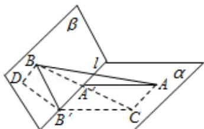

> [!faq]- 2008年重庆市高考数学试卷(文科)含答案解析
>
> > [!success]- **【答案】** 详见解析
>
> > [!note]- **【分析】**
> > (1) 先过点 B 到作平面 $\alpha$ 的垂线, 交点为 D, $\angle BB^{\prime}C$ 为二面角的平面角, 再在直角三角形 BB'D 中求解 BD 即可;
>
> > [!note]- **【解析】**
> > 分析】(1) 先过点 B 到作平面 $\alpha$ 的垂线, 交点为 D, $\angle BB^{\prime}C$ 为二面角的平面角, 再在直角三角形 BB'D 中求解 BD 即可;
> >
> > (2) 先通过平移将两条异面直线平移到同一个起点 A, 得到 $\angle BAC$ 或其补角为异面直线所成的角，在三角形 BAC 中再利用余弦定理求出此角，再用反三角函数表示即可.
> >
> > 【
> > 解答】解：（1）如图，过点 B' 作直线 B'C || A'A 且使 B'C = A'A.
> >
> > 过点 B 作 BD⊥CB'，交 CB' 的延长线于 D.
> >
> > 由已知 AA'⊥l，可得 DB'⊥l，又已知 BB'⊥l，
> >
> > 故l⊥平面BB'D，
> >
> > 得 BD⊥l 又因 BD⊥CB'，从而 BD⊥平面 α，BD 之长即为点 B 到平面 α 的距离。因 B'C⊥l 且 BB'⊥l，故 ∠BB'C 为二面角 α - l - β 的平面角。
> >
> > 由题意， $\angle BB^{\prime}C=\frac{2\pi}{3}$ .
> >
> > 因此在 Rt△BB'D 中，BB'=2，∠BB'D=π - ∠BB'C= $\frac{\pi}{3}$ ，
> >
> > $$
> > \mathrm{BD} = \mathrm{BB} ^ {\prime} \cdot \sin \mathrm{BB} ^ {\prime} \mathrm{D} = \sqrt {3}.
> > $$
> >
> > （Ⅱ）连接 AC、BC．因 B'C ||A'A，B'C=A'A，AA'⊥l，
> >
> > 知 A'ACB' 为矩形，
> >
> > 故 AC||1.
> >
> > 所以 $\angle BAC$ 或其补角为异面直线1与AB所成的角.
> >
> > 在 $\triangle BB^{\prime}C$ 中， $B^{\prime}B = 2$ ， $B^{\prime}C = 3$ ， $\angle BB^{\prime}C = \frac{2\pi}{3}$
> >
> > 则由余弦定理，
> >
> > $$
> > \mathrm{BC} = \sqrt {\mathrm{B} ^ {\prime} \quad \mathrm{B} ^ {2} + \mathrm{B} ^ {\prime} \quad \mathrm{C} ^ {2} - 2 \mathrm{B} ^ {\prime} \quad \mathrm{B} \cdot \mathrm{B} ^ {\prime} \quad \mathrm{C} \cdot \cos \angle \mathrm{BB} ^ {\prime} \quad \mathrm{C}} = \sqrt {1 9}.
> > $$
> >
> > 因 BD⊥平面 $\alpha$ ，且 DC⊥CA，由三垂线定理知 AC⊥BC.
> >
> > 故在 $\triangle ABC$ 中， $\angle BCA=\frac{\pi}{2}$ ， $\sin BAC=\frac{BC}{AB}=\frac{\sqrt{19}}{5}$ .
> >
> > 因此，异面直线l与AB所成的角为 $\arcsin \frac{\sqrt{19}}{5}$
> >
> > 
> >
> > 【点评】本题主要考查立体几何中的主干知识，如线线角、二面角等基础知识，考查空间想象能力、逻辑思维能力和运算能力。解题的关键是线面平行、三垂线定理等基础知识，本题属中等题。
