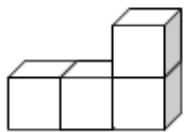
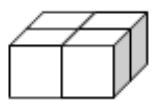
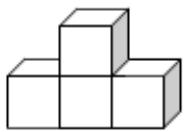
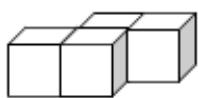
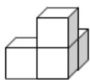
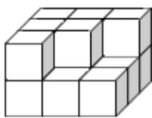

<!-- question-source:start -->
11. (5 分) (2008·重庆) 如图, 模块① - ⑤均由 4 个棱长为 1 的小正方体构成, 模块⑥由 15 个棱长为 1 的小正方体构成. 现从模块① - ⑤中选出三个放到模块⑥上, 使得模块⑥成为一个棱长为 3 的大正方体. 则下列选择方案中, 能够完成任务的为 ( )

  
模块①

  
模块②

  
模块③

  
模块④

  
模块⑤

  
模块⑥

A. 模块①, ②, ⑤ B. 模块①, ③, ⑤ C. 模块②, ④, ⑥ D. 模块③, ④, ⑤
<!-- question-source:end -->

![[高中/真题/按年份分类/2008/2008年重庆市高考数学试卷_文科_含答案/选择题/题目/answers/Q00022978A1.md]]
