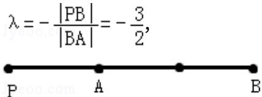

> [!faq]- 2008年重庆市高考数学试卷(文科)含答案解析
>
> > [!success]- **【答案】** A
>
> > [!note]- **【分析】**
> > 本题考查的知识点是线段的定比分点，处理的方法一般是，画出满足条件的图象，根据图象分析分点的位置：是内分点，还是外分点；在线段上，在线段延长线上，还是在线段的反向延长线上．然后代入定比分点公式进行求解.
>
> > [!note]- **【解析】**
> > 解：如图可知，B点是有向线段PA的外分点
> >
> > 
> >
> > 故选A.
> >
> > 【点评】 $\lambda$ 的符号与分点 P 的位置之间的关系: 当 P 点在线段 $\mathrm{P}_{1} \mathrm{P}_{2}$ 上时 $\Leftrightarrow \lambda > 0$ ; 当 P 点在线段 $\mathrm{P}_{1} \mathrm{P}_{2}$ 上的延长线上时 $\Leftrightarrow \lambda < -1$ ; 当 P 点在线段 $\mathrm{P}_{1} \mathrm{P}_{2}$ 上的延长线上时 $\Leftrightarrow -1 < \lambda < 0$ ; 若点 P 分有向线段 $\mathrm{P}_{1} \mathrm{P}_{2}$ 所成的比为 $\lambda$ , 则点 P 分有向线段 $\mathrm{P}_{2} \mathrm{P}_{1}$ 所成的比为 $\frac{1}{\lambda}$ .
