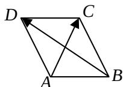

<!-- question-source:start -->
14. 如图，在平行四边形 $ABCD$ 中， $AC =
(12)$ ， $BD = (-32)$ ，则 $AD \square AC = \_$ .

<!-- question-source:end -->

![[高中/真题/按年份分类/2008/2008年高考理科数学试题_天津卷_及参考答案/填空题/题目/answers/Q00027828A1.md]]
