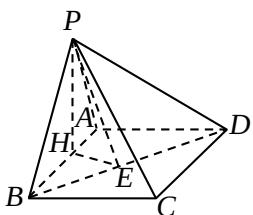

<!-- question-source:start -->
19. 本小题主要考查直线和平面垂直、异面直线所成的角、二面角等基础知识，考查空间想象能力、运算能力和推理论证能力。满分12分。

（Ⅰ）证明：在 $\triangle PAD$ 中，由题设 PA=2，AD=2， $PD=2\sqrt{2}$ ，可得 $PA^{2}+AD^{2}=PD^{2}$ ，于是 $AD\perp PA$ ．在矩形 ABCD 中， $AD\perp AB$ ，又 $PA\cap AB=A$ 所以 $AD\perp$ 平面 PAB．

（Ⅱ）解：由题设， $BC \parallel AD$ ，所以 $\angle PCB$ （或其补角）是异面直线 PC 与 AD 所成的角.

在 $\triangle PAB$ 中，由余弦定理得

$$
P B = \sqrt {P A ^ {2} + A B ^ {2} - 2 P A \square A B \square \cos P A B} = \sqrt {7}
$$

由（Ⅰ）知 $AD \perp$ 平面 PAB， $PB \subset$ 平面 PAB，

所以 $AD \perp PB$ ，因而 $BC \perp PB$ ，于是 $\triangle PBC$ 是直角三角形，

故 $\tan PCB=\frac{PB}{BC}=\frac{\sqrt{7}}{2}$

所以异面直线 PC 与 AD 所成的角的大小为 $\arctan\frac{\sqrt{7}}{2}$ .

（Ⅲ）解：过点 $P$ 作 $PH \perp AB$ 于 $H$ ，过点 $H$ 作 $HE \perp BD$ 于 $E$ ，连结 $PE$ ：

因为 $AD \perp$ 平面 $PAB$ , $PH \subset$ 平面 $PAB$ , 所以 $AD \perp PH$ . 又 $AD \cap AB = A$ , 因而 $PH \perp$ 平面 $ABCD$ , 故 $HE$ 为 $PE$ 在平面 $ABCD$ 内的射影. 由三垂线定理可知, $BD \perp PE$ . 从而 $\angle PEH$ 是二面角 $P - BD - A$ 的平面角.

由题设可得，

$$
P H = P A \text {   sin   } 6 0 ^ {\circ} = \sqrt {3}, A H = P A \text {   cos   } 6 0 ^ {\circ} = 1,
$$

$$
B H = A B - A H = 2, \quad B D = \sqrt {A B ^ {2} + A D ^ {2}} = \sqrt {1 3},
$$

$$
H E = \frac {A D}{B D} \text {   B   } H = \frac {4}{\sqrt {1 3}}
$$

于是在 Rt△PHE 中， $\tan PEH = \frac{PH}{HE} = \frac{\sqrt{39}}{4}$ 。

所以二面角 $P - BD - A$ 的大小为 $\arctan \frac{\sqrt{39}}{4}$
<!-- question-source:end -->

![[高中/真题/按年份分类/2008/2008年高考理科数学试题_天津卷_及参考答案/解答题/题目/answers/Q00025991A1.md]]
