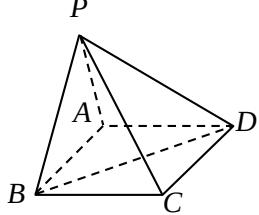

<!-- question-source:start -->
## 19. （本小题满分 12 分）

如图，在四棱锥 P - ABCD 中，底面 ABCD 是矩形．已知 AB = 3，AD = 2，PA = 2，

$PD = 2\sqrt{2}$ ， $\angle PAB = 60^{\circ}$

（Ⅰ）证明 $AD \perp$ 平面 PAB；

（Ⅱ）求异面直线 $PC$ 与 $AD$ 所成的角的大小；

(Ⅲ) 求二面角 $P - BD - A$ 的大小.
<!-- question-source:end -->

![[高中/真题/按年份分类/2008/2008年高考理科数学试题_天津卷_及参考答案/解答题/题目/answers/Q00027832A1.md]]
