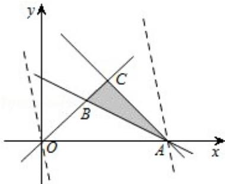

> [!faq]- 2008年高考理科数学试题(天津卷)及参考答案解析
>
> > [!success]- **【答案】** D
>
> > [!note]- **【分析】**
> > 本题主要考查线性规划的基本知识，先画出约束条件 $(x+2y\geqslant1)$ 的可行域，再求出可行域中各角点的坐标，将各点坐标代入目标函数的解析式，分析后易得目标函数 $Z=5x+y$ 的最小值.
>
> > [!note]- **【解析】**
> > 解：满足约束条件的可行域如图，
> >
> > 由图象可知：
> >
> > 目标函数 $z = 5x + y$ 过点A（1，0）时
> >
> > z 取得最大值， $z_{max}=5$ ，
> >
> > 故选D.
> >
> > 
> >
> > 【点评】在解决线性规划的问题时，我们常用“角点法”，其步骤为：①由约束条件画出可行域⇒②求出可行域各个角点的坐标⇒③将坐标逐一代入目标函数⇒④验证，求出最优解.
