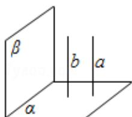
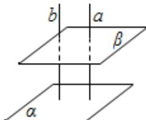
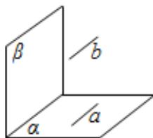

> [!faq]- 2008年高考理科数学试题(天津卷)及参考答案解析
>
> > [!success]- **【答案】** C
>
> > [!note]- **【分析】**
> > 根据题意分别画出错误选项的反例图形即可.
>
> > [!note]- **【解析】**
> > 解：A、B、D 的反例如图.
> >
> > 
> >
> > 
> >
> > 
> >
> > 故选C.
> >
> > 【点评】本题考查线面垂直、平行的性质及面面垂直、平行的性质，同时考查充分条件的含义及空间想象能力.
> >
> > $$
> > \frac {x ^ {2}}{m ^ {2}} + \frac {y ^ {2}}{m ^ {2} - 1} = 1 (m > 1)
> > $$
