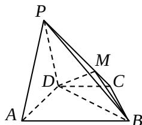

<!-- question-source:start -->
19. （本小题满分 12 分）

如图, 在四棱锥 $P - ABCD$ 中, 平面 $PAD \perp$ 平面 $ABCD$ , $AB \parallel DC$ , $\triangle PAD$ 是等边三角形, 已知 $BD = 2AD = 8$ , $AB = 2DC = 4\sqrt{5}$ .

（Ⅰ）设 M 是 PC 上的一点，证明：平面 $MBD \perp$ 平面 PAD；

（Ⅱ）求四棱锥 P - ABCD 的体积.

## 20. （本小题满分 12 分）

将数列 $\left\{a_{n}\right\}$ 中的所有项按每一行比上一行多一项的规则排成如下数表：

$$
a _ {1}
$$

$$
\begin{array}{c c} a _ {2} & a _ {3} \end{array}
$$

$$
\begin{array}{c c c} a _ {4} & a _ {5} & a _ {6} \end{array}
$$

$$
\begin{array}{c c c c} a _ {7} & a _ {8} & a _ {9} & a _ {1 0} \end{array}
$$

记表中的第一列数 $a_1, a_2, a_4, a_7$ ，构成的数列为 $\{b_n\}$ ， $b_1 = a_1 = 1 \cdot S_n$ 为数列 $\{b_n\}$ 的前 $n$ 项和，且满足 $\frac{2b_n}{b_nS_n - S_n^2} = 1 (n \geq 2)$ .

（Ⅰ）证明数列 $\left\{\frac{1}{S_{n}}\right\}$ 成等差数列，并求数列 $\left\{b_{n}\right\}$ 的通项公式；

（II）上表中，若从第三行起，第一行中的数按从左到右的顺序均构成等比数列，且公比为同一个正数．当 $a_{81}=-\frac{4}{91}$ 时，求上表中第 $k(k\geq3)$ 行所有项的和.

## 21. （本小题满分 12 分）

设函数 $f(x) = x^{2}e^{x - 1} + ax^{3} + bx^{2}$ ，已知 $x = -2$ 和 $x = 1$ 为 $f(x)$ 的极值点.

(Ⅰ) 求 a 和 b 的值;

（Ⅱ）讨论 $f(x)$ 的单调性；

(III) 设 $g(x)=\frac{2}{3}x^{3}-x^{2}$ ，试比较 $f(x)$ 与 $g(x)$ 的大小.

## 22. （本小题满分14分）

已知曲线 $C_1 \frac{|x|}{a} + \frac{|y|}{b} = 1 (a > b > 0)$ 所围成的封闭图形的面积为 $4\sqrt{5}$ ，曲线 $C_1$ 的内切圆半径为 $\frac{2\sqrt{5}}{3}$ 。记 $C_2$ 为以曲线 $C_1$ 与坐标轴的交点为顶点的椭圆。

（Ⅰ）求椭圆 $C_{2}$ 的标准方程；

（Ⅱ）设 $AB$ 是过椭圆 $C_2$ 中心的任意弦， $l$ 是线段 $AB$ 的垂直平分线。 $M$ 是 $l$ 上异于椭圆中心的点。

(1) 若 $\left|MO\right|=\lambda\left|OA\right|$ （O 为坐标原点），当点 A 在椭圆 $C_{2}$ 上运动时，求点 M 的轨迹方程；

(2) 若 $M$ 是 $l$ 与椭圆 $C_2$ 的交点，求 $\triangle AMB$ 的面积的最小值.

## 2008年普通高等学校招生全国统一考试
<!-- question-source:end -->

![[高中/真题/按年份分类/2008/2008年高考真题数学_文__山东卷__含解析版_/解答题/题目/answers/Q00026250A1.md]]
