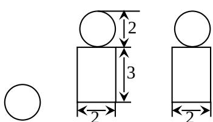

<!-- question-source:start -->
6. 右图是一个几何体的三视图，根据图中数据，可得该几何体的表面积是（）
A. $9\pi$ B. $10\pi$ C. $11\pi$ D. $12\pi$

  
俯视图 正(主)视图侧(左)视图
<!-- question-source:end -->

![[高中/真题/按年份分类/2008/2008年高考真题数学_文__山东卷__含解析版_/选择题/题目/answers/Q00026238A1.md]]
