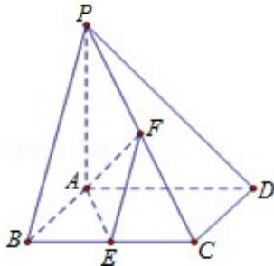

<!-- question-source:start -->
20. （12分）（2008·山东）如图，已知四棱锥P-ABCD，底面ABCD为菱形，PA⊥平面ABCD， $\angle ABC = 60^{\circ}$ ，E，F分别是BC，PC的中点.

（Ⅰ）证明：AE⊥PD；

（II）若 H 为 PD 上的动点，EH 与平面 PAD 所成最大角的正切值为 $\frac{\sqrt{6}}{2}$ ，求二面角 E - AF - C 的余弦值.

<!-- question-source:end -->

![[高中/真题/按年份分类/2008/2008年高考真题数学_理__山东卷__含解析版_/解答题/题目/answers/Q00026318A1.md]]
