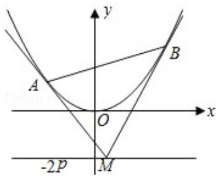

<!-- question-source:start -->
22. (14分) (2008·山东) 如图, 设抛物线方程为 $x^{2} = 2py (p > 0)$ , M 为直线 $y = -2p$ 上任意一点, 过 M 引抛物线的切线, 切点分别为 A, B.

（Ⅰ）求证：A，M，B三点的横坐标成等差数列；

（Ⅱ）已知当 M 点的坐标为 $(2, -2p)$ 时， $|AB|=4\sqrt{10}$ 。求此时抛物线的方程；

(III) 是否存在点 M，使得点 C 关于直线 AB 的对称点 D 在抛物线 $x^{2}=2py$ (p>0) 上，其中，点 C 满足 $\overrightarrow{OC}=\overrightarrow{OA}+\overrightarrow{OB}$ (O 为坐标原点). 若存在，求出所有适合题意的点 M 的坐标；若不存在，请说明理由.

# 2008年山东省高考数学试卷（理科）

参考答案与试题解析

##
一、选择题（共12小题，每小题5分，满分60分）
<!-- question-source:end -->

![[高中/真题/按年份分类/2008/2008年高考真题数学_理__山东卷__含解析版_/解答题/题目/answers/Q00030881A1.md]]
