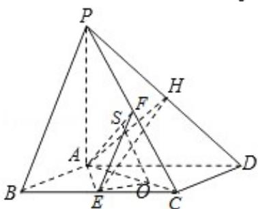

> [!faq]- 2008年高考真题数学【理】(山东卷)（含解析版）解析
>
> > [!success]- **【答案】** 08·山东) 满足 $\mathrm{M} \subseteq \{\mathrm{a}_1, \mathrm{a}_2, \mathrm{a}_3, \mathrm{a}_4\}$ , 且 $\mathrm{M} \cap \{\mathrm{a}_1, \mathrm{a}_2, \mathrm{a}_3\} = \{\mathrm{a}_1, \mathrm{a}_2\}$ 的集合 $\mathbf{M}$ 的个数是 ( )
>
> > [!note]- **【分析】**
> > （1）要证明 AE⊥PD，我们可能证明 AE⊥面 PAD，由已知易得 AE⊥PA，我们只要能证明 AE⊥AD 即可，由于底面 ABCD 为菱形，故我们可以转化为证明 AE⊥BC，由已知易我们不难得到结论.
> > (2) 由 EH 与平面 PAD 所成最大角的正切值为 $\frac{\sqrt{6}}{2}$ , 我们分析后可得 PA 的值, 由
> > (1) 的结论, 我们进而可以证明平面 PAC⊥平面 ABCD, 则过 E 作 EO⊥AC 于 O, 则 EO⊥平面 PAC, 过 O 作 OS⊥AF 于 S, 连接 ES, 则 ∠ESO 为二面角 E - AF - C 的平面角, 然后我们解三角形 ASO, 即可求出二面角 E - AF - C 的余弦值.
>
> > [!note]- **【解析】**
> > 证明：（Ⅰ）证明：由四边形 ABCD 为菱形， $\angle ABC=60^{\circ}$ ，可得 $\triangle ABC$ 为正三角形。因为 E 为 BC 的中点，所以 AE⊥BC。
> >
> > 又 BC∥AD，因此 AE⊥AD.
> >
> > 因为 PA⊥平面 ABCD，AE⊂平面 ABCD，所以 PA⊥AE.
> >
> > 而 PAC⊂平面 PAD，ADC⊂平面 PAD 且 PA∩AD=A，
> >
> > 所以 AE⊥平面 PAD. 又 PDC 平面 PAD,
> >
> > 所以 AE⊥PD.
> >
> > 解：（Ⅱ）设 AB=2，H 为 PD 上任意一点，连接 AH，EH.
> >
> > 由（Ⅰ）知 AE⊥平面 PAD，
> >
> > 则 $\angle EHA$ 为EH与平面PAD所成的角.
> >
> > 在 Rt△EAH 中，AE=√3，
> >
> > 所以当 AH 最短时， $\angle EHA$ 最大，
> >
> > 即当 AH⊥PD 时，∠EHA 最大.
> >
> > 此时 $\tan \angle EHA = \frac{AE}{AH} = \frac{\sqrt{3}}{AH} = \frac{\sqrt{6}}{2}$
> >
> > 因此 $AH=\sqrt{2}$ . 又 AD=2，所以 $\angle ADH=45^{\circ}$ ,
> >
> > 所以 PA=2.
> >
> > 因为 PA⊥平面 ABCD，PAC 平面 PAC，
> >
> > 所以平面 PAC⊥平面 ABCD.
> >
> > 过 E 作 EO⊥AC 于 O，则 EO⊥平面 PAC，
> >
> > 过O作OS⊥AF于S，连接ES，则∠ESO为二面角E-AF-C的平面角，
> >
> > 在 Rt△AOE 中， $EO=AE\cdot\sin30^{\circ}=\frac{\sqrt{3}}{2}$ ， $AO=AE\cdot\cos30^{\circ}=\frac{3}{2}$
> >
> > 又 F 是 PC 的中点，在 Rt△ASO 中， $SO=AO\cdot\sin45^{\circ}=\frac{3\sqrt{2}}{4}$
> >
> > 又 $\mathrm{SE} = \sqrt{\mathrm{EO}^2 + \mathrm{SO}^2} = \sqrt{\frac{3}{4} + \frac{9}{8}} = \frac{\sqrt{30}}{4},$
> >
> > 在 Rt△ESO 中，cos∠ESO= $\frac{SO}{SE}=\frac{\frac{3\sqrt{2}}{4}}{\frac{\sqrt{30}}{4}}=\frac{\sqrt{15}}{5}$ ,
> >
> > 即所求二面角的余弦值为 $\frac{\sqrt{15}}{5}$ .
> >
> > 
