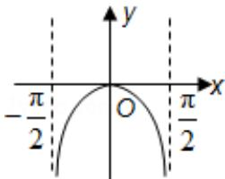
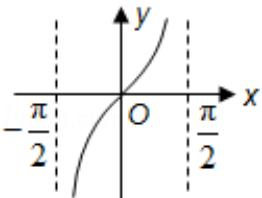

<!-- question-source:start -->
3. (5分) (2008·山东) 函数 $y = \ln \cos x \left( -\frac{\pi}{2} < x < \frac{\pi}{2} \right)$ 的图象是（）

A.

B.

C.

D.

<!-- question-source:end -->

![[高中/真题/按年份分类/2008/2008年高考真题数学_理__山东卷__含解析版_/选择题/题目/answers/Q00026302A1.md]]
