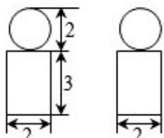

<!-- question-source:start -->
6.（5 分）（2008·山东）如图是一个几何体的三视图，根据图中数据，可得该几何体的表面积是（）

俯视图 正(主)视图 侧(左)视图
A. $9\pi$ B. $10\pi$ C. $11\pi$ D. $12\pi$
<!-- question-source:end -->

![[高中/真题/按年份分类/2008/2008年高考真题数学_理__山东卷__含解析版_/选择题/题目/answers/Q00026305A1.md]]
