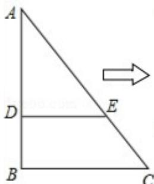
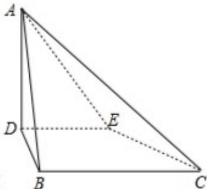

<!-- question-source:start -->
19. (13 分) (2008·重庆) 如图, 在 $\triangle ABC$ 中, $B = 90^{\circ}$ , $AC = \frac{15}{2}$ , D、E 两点分别在 AB、AC 上. 使 $\frac{AD}{DB} = \frac{AE}{EC} = 2$ , $DE = 3$ . 现将 $\triangle ABC$ 沿 DE 折成直二角角, 求

（Ⅰ）异面直线 AD 与 BC 的距离；

（Ⅱ）二面角 A - EC - B 的大小（用反三角函数表示）.

<!-- question-source:end -->

![[高中/真题/按年份分类/2008/2008年高考重庆理科数学试题及答案_精校版_/填空题/题目/answers/Q00022816A1.md]]
