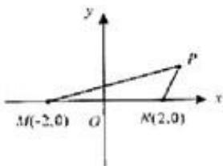

<!-- question-source:start -->
21. （12分）（2008·重庆）如图，M（-2，0）和N（2，0）是平面上的两点，动点P满足： $|\mathrm{PM}|+|\mathrm{PN}|=6$

（Ⅰ）求点 P 的轨迹方程；

（II）若 $|\mathsf{PM}| \cdot |\mathsf{PN}| = \frac{2}{1 - \cos\angle\mathsf{MPN}}$ ，求点P的坐标.

<!-- question-source:end -->

![[高中/真题/按年份分类/2008/2008年高考重庆理科数学试题及答案_精校版_/填空题/题目/answers/Q00022818A1.md]]
