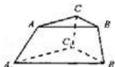

<!-- question-source:start -->
16. (4 分) (2008·重庆) 某人有 4 种颜色的灯泡 (每种颜色的灯泡足够多), 要在如图所示的 6 个点 A、B、C、 $A_{1}$ 、 $B_{1}$ 、 $C_{1}$ 上各装一个灯泡, 要求同一条线段两端的灯泡不同色, 则每种颜色的灯泡都至少用一个的安装方法共有 \_\_\_\_ 种 (用数字作答).

##
<!-- question-source:end -->

![[高中/真题/按年份分类/2008/2008年高考重庆理科数学试题及答案_精校版_/填空题/题目/answers/Q00029689A1.md]]
