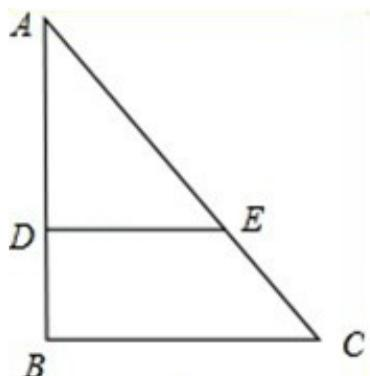
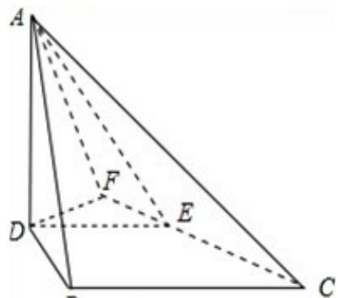

> [!faq]- 2008年高考重庆理科数学试题及答案(精校版)解析
>
> > [!success]- **【答案】** 详见解析
>
> > [!note]- **【分析】**
> > (1) 先依据公垂线的定义, 证明 DB 为异面直线 AD 与 BC 的公垂线, 再求 DB 之长, 注意到它是 AB 长的 $\frac{1}{3}$ 倍, 故先求出 AB 的长即可;
>
> > [!note]- **【解析】**
> > 分析: (1) 先依据公垂线的定义, 证明 DB 为异面直线 AD 与 BC 的公垂线, 再求 DB 之长, 注意到它是 AB 长的 $\frac{1}{3}$ 倍, 故先求出 AB 的长即可;
> >
> > (2) 过 D 作 DF⊥CE，交 CE 的延长线于 F，先证得 $\angle AFD$ 为二面角 A-BC-B 的平面角，再利用直角三角形中的边角关系求出其正切值即得.
> >
> > 解答：解：（Ⅰ）在图1中，因 $\frac{AD}{DB} = \frac{AE}{CE}$ ，故BE∥BC．又因 $B = 90^{\circ}$ ，从而AD⊥DE.
> >
> >   
> > 图1
> >
> >   
> > 图2
> >
> > 在图2中，因A-DE-B是直二面角，AD⊥DE，故AD⊥底面DBCE，从而AD⊥DB．而DB⊥BC，故DB为异面直线AD与BC的公垂线.
> >
> > 下求DB之长．在图1中，由 $\frac{\mathrm{AD}}{\mathrm{CB}} = \frac{\mathrm{AE}}{\mathrm{BC}} = 2$ ，得 $\frac{\mathrm{DE}}{\mathrm{BC}} = \frac{\mathrm{AD}}{\mathrm{AB}} = \frac{2}{3}$
> >
> > 又已知 DE=3，从而 $BC=\frac{3}{2}DE=\frac{9}{2}$ . $AB=\sqrt{AC^{2}-BC^{2}}=\sqrt{\left(\frac{15}{2}\right)^{2}-\left(\frac{9}{2}\right)^{2}}=6$ . 因 $\frac{DB}{AB}=\frac{1}{3}$ ，故 DB=2.
> >
> > （Ⅱ）在第图2中，过D作DF⊥CE，交CE的延长线于F，连接AF．由（1）知，
> >
> > AD⊥底面 DBCE，由三垂线定理知 AF⊥FC，故∠AFD 为二面角 A - BC - B 的平面
> >
> > 角．在底面 DBCE 中， $\angle DEF = \angle BCE$ ，DB = 2， $EC = \frac{1}{3} \cdot \frac{15}{2} = \frac{5}{2}$
> >
> > 因此 $\sin BCE = \frac{DB}{EC} = \frac{4}{5}$ . 从而在 Rt△DFE 中, DE = 3, DF = DE sin DEF = DE sin BCE = 3 · $\frac{4}{5} = \frac{12}{5}$ .
> >
> > 在Rt△AFD中，AD=4，tanAFD= $\frac{AD}{DF}=\frac{5}{3}$ .
> >
> > 因此所求二面角 A - EC - B 的大小为 $\arctan\frac{5}{3}$ .
> >
> > 点评：本小题主要考查直线与平面平行、二面角等基础知识，考查空间想象能力，运算能力和推理论证能力.
