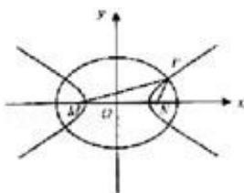

> [!faq]- 2008年高考重庆理科数学试题及答案(精校版)解析
>
> > [!success]- **【答案】** 详见解析
>
> > [!note]- **【分析】**
> > （1）先根据题意求出 a，b，c 的值，再代入到椭圆方程的标准形式中，可得到答案.
> > (2) 先将 $|\mathrm{PM}| \cdot |\mathrm{PN}| = \frac{2}{1 - \cos\angle\mathrm{MPN}}$ 转化为 $|\mathrm{PM}| \cdot |\mathrm{PN}|\cos \mathrm{MPN} = |\mathrm{PM}| \cdot |\mathrm{PN}| - 2$ 的形式，再由余弦定理得到 $|\mathrm{MN}|^2 = |\mathrm{PM}|^2 + |\mathrm{PN}|^2 - 2|\mathrm{PM}| \cdot |\mathrm{PN}|\cos \mathrm{MPN}$ ，二者联立后再由点P在椭圆方程上可得到最后答案.
>
> > [!note]- **【解析】**
> > 解：（Ⅰ）由椭圆的定义，点P的轨迹是以M、N为焦点，长轴长2a=6的椭圆.
> >
> > 因此半焦距 $c = 2$ ，长半轴 $a = 3$ ，从而短半轴 $b = \sqrt{a^2 - c^2} = \sqrt{5}$
> >
> > 所以椭圆的方程为 $\frac{x^{2}}{9}+\frac{y^{2}}{5}=1$ .
> >
> > （II）由 $|\mathrm{PM}| \cdot |\mathrm{PN}| = \frac{2}{1 - \cos\mathrm{MPN}}$ ，得 $|\mathrm{PM}| \cdot |\mathrm{PN}|\cos \mathrm{MPN} = |\mathrm{PM}| \cdot |\mathrm{PN}| - 2.$ ①
> >
> > 因为 $\cos MPN \neq 1$ ，P 不为椭圆长轴顶点，故 P、M、N 构成三角形.
> >
> > 在 $\triangle$ PMN中， $|MN|=4$ ，由余弦定理有 $|MN|^{2}=|PM|^{2}+|PN|^{2}-2|PM|\cdot|PN|\cos MPN$ ．②
> >
> > 将①代入②，得 $4^{2} = |\mathrm{PM}|^{2} + |\mathrm{PN}|^{2} - 2$ （ $|\mathrm{PM}|\bullet |\mathrm{PN}| - 2)$
> >
> > 故点P在以M、N为焦点，实轴长为 $2\sqrt{3}$ 的双曲线 $\frac{x^2}{3} - y^2 = 1$ 上.
> >
> > 由（Ⅰ）知，点P的坐标又满足 $\frac{x^{2}}{9}+\frac{y^{2}}{5}=1$ ，
> >
> > 所以由方程组 $\left\{ \begin{array}{l}5x^{2} + 9y^{2} = 45\\ x^{2} + 3y^{2} = 3. \end{array} \right.$ 解得 $\left\{ \begin{array}{l}\mathbf{x} = \pm \frac{3\sqrt{3}}{2}\\ y = \pm \frac{\sqrt{5}}{2}. \end{array} \right.$
> >
> > 即P点坐标为 $\left(\frac{3\sqrt{3}}{2},\frac{\sqrt{5}}{2}\right)$ 、 $\left(\frac{3\sqrt{3}}{2}, - \frac{\sqrt{5}}{2}\right)$ 、 $\left(-\frac{3\sqrt{3}}{2},\frac{\sqrt{5}}{2}\right)$ 或 $\left(-\frac{3\sqrt{3}}{2}, - \frac{\sqrt{5}}{2}\right)$
> >
> > 
> >
> > 点评：本题主要考查椭圆的标准方程. 椭圆的标准方程、离心率、第二定义、准线方程、a, b, c 的基本关系等都是高考的考点，要熟练掌握.
