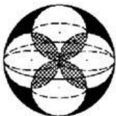

<!-- question-source:start -->
9. (5 分) (2008·重庆) 如图, 体积为 V 的大球内有 4 个小球, 每个小球的球面过大球球心且与大球球面有且只有一个交点, 4 个小球的球心是以大球球心为中心的正方形的 4 个顶点. $V_{1}$ 为小球相交部分 (图中阴影部分) 的体积, $V_{2}$ 为大球内、小球外的图中黑色部分的体积, 则下列关系中正确的是 ( )

A. $V_{1} > \frac{V}{2}$ B. $V_{2} < \frac{V}{2}$ C. $V_{1} > V_{2}$ D. $V_{1} < V_{2}$
<!-- question-source:end -->

![[高中/真题/按年份分类/2008/2008年高考重庆理科数学试题及答案_精校版_/选择题/题目/answers/Q00022806A1.md]]
