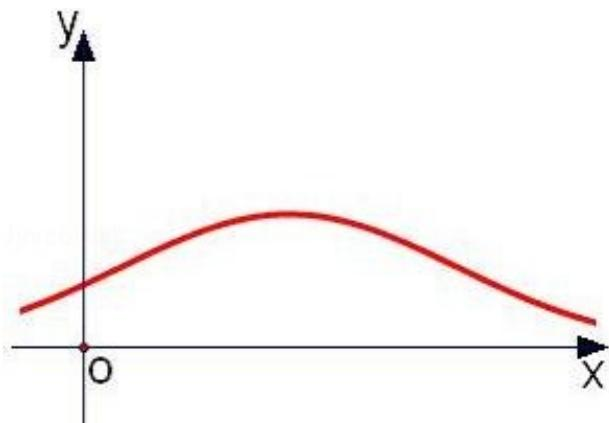

> [!faq]- 2008年高考重庆理科数学试题及答案(精校版)解析
>
> > [!success]- **【答案】** D
>
> > [!note]- **【分析】**
> > 由正态分布的图象规律知，其在 $x = \mu$ 左侧一半的概率为 $\frac{1}{2}$ ，故得 $P(\zeta < 3)$ 的值.
>
> > [!note]- **【解析】**
> > 分析：由正态分布的图象规律知，其在 $x = \mu$ 左侧一半的概率为 $\frac{1}{2}$ ，故得 $P(\zeta < 3)$ 的值.
> >
> > 解答：解： $\zeta$ 服从正态分布 $N(3, \sigma^2)$ ，曲线关于 $x = 3$ 对称， $P(\zeta < 3) = \frac{1}{2}$ ，故选D.
> >
> > 
> >
> > 点评：本题主要考查正态分布的图象，结合正态曲线，加深对正态密度函数的理解.
