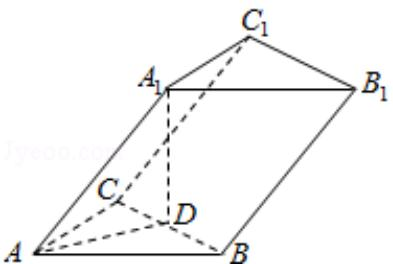

# 2009年全国统一高考数学试卷（文科）（全国卷Ⅰ）

##
一、选择题（共12小题，每小题5分，满分60分）

1. (5分) $\sin 585^{\circ}$ 的值为（）
A. $\frac{\sqrt{2}}{2}$ B. $\frac{\sqrt{2}}{2}$ C. $\frac{\sqrt{3}}{2}$ D. $\frac{\sqrt{3}}{2}$

2. (5 分) 设集合 $A = \{4, 5, 7, 9\}$ , $B = \{3, 4, 7, 8, 9\}$ , 全集 $U = A \cup B$ , 则集合 $C_U(A \cap B)$ 中的元素共有（）
A. 3 个    B. 4 个    C. 5 个    D. 6 个

3. （5分）不等式 $\left|\frac{x+1}{x-1}\right|<1$ 的解集为（）
A. $\{x\mid0<x<1\}\cup\{x\mid x>1\}$ B. $\{x\mid0<x<1\}$ C. $\{x\mid-1<x<0\}$ D. $\{x\mid x<0\}$

4. （5分）已知 $\tan a = 4$ ， $\cot \beta = \frac{1}{3}$ ，则 $\tan (a + \beta) = (\quad)$ A. $\frac{7}{11}$ B. $-\frac{7}{11}$ C. $\frac{7}{13}$ D. $-\frac{7}{13}$

5. (5 分) 已知双曲线 $\frac{x^2}{a^2} - \frac{y^2}{b^2} = 1 (a > 0, b > 0)$ 的渐近线与抛物线 $y = x^2 + 1$ 相切, 则该双曲线的离心率为 ( )

A. $\sqrt{3}$ B. 2

C. $\sqrt{5}$ D. $\sqrt{6}$

6. (5 分) 已知函数 $f(x)$ 的反函数为 $g(x) = 1 + 2\lg x (x > 0)$ ，则 $f(1) + g(1) = (\quad)$

A. 0 B. 1 C. 2 D. 4

7. (5 分) 甲组有 5 名男同学, 3 名女同学; 乙组有 6 名男同学、2 名女同学. 若从甲、
乙两组中各选出 2 名同学, 则选出的 4 人中恰有 1 名女同学的不同选法共有 ( )
A. 150 种 B. 180 种 C. 300 种 D. 345 种

8. (5 分) 设非零向量 $\vec{a}, \vec{b}, \vec{c}$ 满足 $|\vec{a}| = |\vec{b}| = |\vec{c}|$ , $\vec{a} + \vec{b} = \vec{c}$ , 则 $<\vec{a}, \vec{b}> = (\quad)$ A. $150^{\circ}$ B. $120^{\circ}$ C. $60^{\circ}$ D. $30^{\circ}$

9. (5 分) 已知三棱柱 $ABC - A_{1}B_{1}C_{1}$ 的侧棱与底面边长都相等, $A_{1}$ 在底面 $ABC$ 上的射影 $D$ 为 $BC$ 的中点, 则异面直线 $AB$ 与 $CC_{1}$ 所成的角的余弦值为 ( )

A. $\frac{\sqrt{3}}{4}$ B. $\frac{\sqrt{5}}{4}$ C. $\frac{\sqrt{7}}{4}$ D. $\frac{3}{4}$

10. (5 分) 如果函数 $y = 3\cos (2x + \varphi)$ 的图象关于点 $(\frac{4\pi}{3}, 0)$ 中心对称, 那么 $|\varphi|$ 的最小值为 ( )

A. $\frac{\pi}{6}$ B. $\frac{\pi}{4}$ C. $\frac{\pi}{3}$ D. $\frac{\pi}{2}$

11.（5分）已知二面角 $\alpha - 1 - \beta$ 为 $60^{\circ}$ ，动点 $P$ 、 $Q$ 分别在面 $\alpha$ 、 $\beta$ 内， $P$ 到 $\beta$ 的距离

为 $\sqrt{3}$ ，Q到 $\alpha$ 的距离为 $2\sqrt{3}$ ，则P、Q两点之间距离的最小值为（）

A. 1 B. 2 C. $2\sqrt{3}$ D. 4

12.（5分）已知椭圆C: $\frac{x^2}{2} + y^2 = 1$ 的右焦点为F，右准线为I，点A∈I，线段AF交C于点B，若 $\overrightarrow{FA} = 3\overrightarrow{FB}$ ，则 $|\overrightarrow{AF}| = (\quad)$ A. $\sqrt{2}$ B. 2 C. $\sqrt{3}$ D. 3

##

![[高中/真题/按年份分类/2009/2009年全国统一高考数学试卷_文科__全国卷ⅰ__含解析版_/填空题/填空题.md]]
![[高中/真题/按年份分类/2009/2009年全国统一高考数学试卷_文科__全国卷ⅰ__含解析版_/选择题/选择题.md]]
![[高中/真题/按年份分类/2009/2009年全国统一高考数学试卷_文科__全国卷ⅰ__含解析版_/解答题/解答题.md]]
