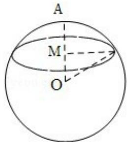

<!-- question-source:start -->
15. (5 分) 已知 OA 为球 O 的半径, 过 OA 的中点 M 且垂直于 OA 的平面截球面得
到圆 M．若圆 M 的面积为 $3\pi$ ，则球 O 的表面积等于\_\_\_\_。

<!-- question-source:end -->

![[高中/真题/按年份分类/2009/2009年全国统一高考数学试卷_文科__全国卷ⅰ__含解析版_/填空题/题目/answers/Q00024694A1.md]]
