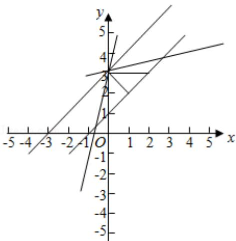

> [!faq]- 2009年全国统一高考数学试卷（文科）（全国卷ⅰ）（含解析版）解析
>
> > [!success]- **【答案】** 的序号 是 ①或⑤ （写出所有正确
>
> > [!note]- **【分析】**
> > 先求两平行线间的距离，结合题意直线 m 被两平行线 $I_{1}$ 与 $I_{2}$ 所截得的线
>
> > [!note]- **【解析】**
> > 答案的序号
> >
> > 是 ①或⑤ （写出所有正确
> > 答案的序号）
> >
> > 【考点】I2：直线的倾斜角；N1：平行截割定理.
> >
> > 【专题】11：计算题；15：综合题；16：压轴题.
> >
> > 【
> > 分析】先求两平行线间的距离，结合题意直线 m 被两平行线 $I_{1}$ 与 $I_{2}$ 所截得的线
> >
> > 段的长为 $2\sqrt{2}$ ，求出直线 $m$ 与 $l_{1}$ 的夹角为 $30^{\circ}$ ，推出结果.
> >
> > 【
> > 解答】解：两平行线间的距离为 $d = \frac{|3 - 1|}{\sqrt{1 + 1}} = \sqrt{2}$ ，
> >
> > 由图知直线 m 与 $I_{1}$ 的夹角为 $30^{\circ}$ ， $I_{1}$ 的倾斜角为 $45^{\circ}$ ，
> >
> > 所以直线 m 的倾斜角等于 $30^{\circ}+45^{\circ}=75^{\circ}$ 或 $45^{\circ}-30^{\circ}=15^{\circ}$ .
> >
> > 故填写①或⑤
> >
> > 故
> > 答案为：①或⑤
> >
> > 
> >
> > 【点评】本题考查直线的斜率、直线的倾斜角，两条平行线间的距离，考查数形结合的思想.
> >
> > ## 三、解答题（共6小题，满分70分）
